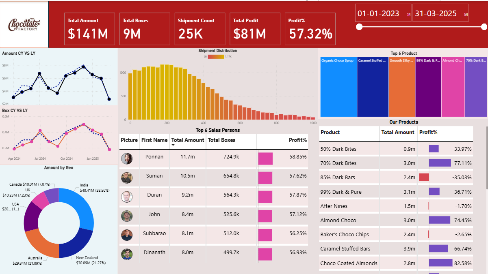
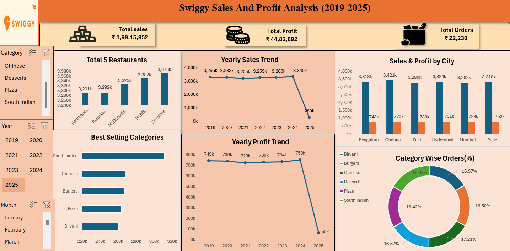

# Data-Analytics--Projects-
Power BI and Excel projects (Chocolate Factory Sales Dashboard ,Excel Sales Analytics Project Swiggy Sales 2019–2025)
# 📊 Data Analytics Projects

## 📌 Overview  
This repository contains my **Data Analytics projects** built using **Power BI** and **Excel**.  
The projects focus on real-world datasets and demonstrate skills in **data cleaning, analysis, visualization, and insights generation**.  

---

## 🏭 Project 1: Chocolate Factory Sales Dashboard (Power BI)  
**Tools:** Power BI  
**Dataset:** Chocolate Factory sales data (2019–2025)  

### 🔹 Key Steps:
- Collected and cleaned sales data.  
- Built interactive dashboards with KPIs (Total Sales, Total Profit, Profit %, etc.).  
- Added filters for time periods and products.  
- Used visuals like line charts, bar charts, pie charts, and tree maps for better insights.  

### 📊 Insights:
- Identified top-performing products.  
- Analyzed profit margins across product categories.  
- Found seasonal sales trends and region-wise performance.  

**Screenshot:**  
  

---

## 🍽️ Project 2: Swiggy Restaurant Sales Analysis (Excel)  
**Tools:** Microsoft Excel (Pivot Tables, Charts, Functions)  
**Dataset:** Swiggy Sales Data (2019–2025)  

### 🔹 Key Steps:
- Cleaned and formatted restaurant sales data.  
- Built pivot tables for order counts, revenue, and profitability.  
- Created interactive dashboards using slicers and charts.  

### 📊 Insights:
- Top restaurants by sales and orders.  
- Customer order patterns and preferences.  
- Profit analysis over multiple years.  

**Screenshot:**  

---

## 🎯 Skills Demonstrated
- Data Cleaning and Preprocessing  
- Business Analytics with Excel  
- Dashboard Design with Power BI  
- Data Visualization (KPIs, Trends, Patterns)  
- Analytical Thinking & Insight Generation  

---

## 📂 Repository Structure
